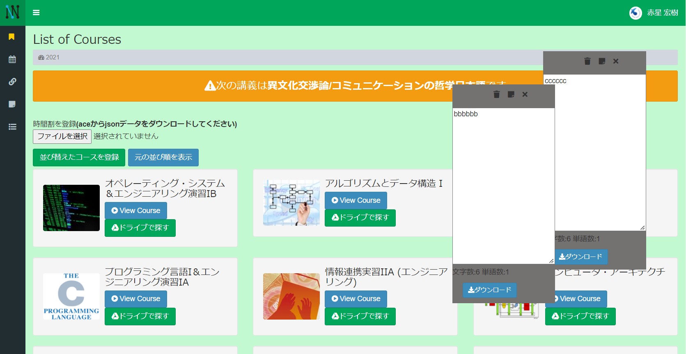

# INIAD++ (Firefox 版)


東洋大学情報連携学部(INIAD)のオンライン教育システム [INIAD MOOCs](https://moocs.iniad.org/) とその周辺サイト群に様々な機能を追加する Firefox 拡張機能です。

本リポジトリは [Kensuke-sam/iniad_plus](https://github.com/Kensuke-sam/iniad_plus) (Chrome 版) を Firefox 向けに移植したものです。

## インストール方法

Firefox には大きく分けて 2 種類の入れ方があります。お手軽に試したい人は **A. 一時的に入れる方法**、再起動後も使いたい人は **B. ずっと使えるようにする方法** を参照してください。

### 事前準備：ソースコードを入手する
1. このリポジトリの [`Code` ボタン](https://github.com/Kensuke-sam/iniad_plus) → **Download ZIP** をクリックしてダウンロードし、好きな場所に展開します。
   - Git が使えるなら `git clone https://github.com/Kensuke-sam/iniad_plus.git` でも OK です。
2. 展開後に `iniad_plus_firefox/` というフォルダーができていることを確認してください。このフォルダーの中に `manifest.json` が入っています。

---

### A. 一時的に入れる方法（再起動で消える / 誰でも可）

通常版の Firefox でも利用できる、最も簡単な手順です。ただし **Firefox を再起動すると自動的に解除される** ため、使うたびに読み込む必要があります。

1. Firefox を起動し、アドレスバーに `about:debugging#/runtime/this-firefox` と入力して Enter
2. 左のメニューで **This Firefox**（この Firefox）を選ぶ
3. 画面上部の **一時的なアドオンを読み込む... / Load Temporary Add-on...** ボタンを押す
4. ファイル選択ダイアログで、先ほど展開した `iniad_plus_firefox/manifest.json` を選んで開く
5. 一覧に **INIAD++ (Firefox)** が追加されれば成功です
6. [https://moocs.iniad.org/](https://moocs.iniad.org/) を開いて機能が動くか確認してください

#### 更新・解除
- コードを書き換えた場合は、同じ画面で **再読み込み / Reload** を押すと反映されます
- やめたいときは **削除 / Remove** を押すか、Firefox を再起動してください

---

### B. ずっと使えるようにする方法

通常版 Firefox は **署名されていないアドオンを恒久的に入れることはできません**（`xpinstall.signatures.required` を `false` にできないため）。以下のいずれかの方法を選んでください。

#### B-1. 開発者向け Firefox を使う（署名不要）
Firefox Developer Edition / Nightly / ESR では署名チェックを無効化できます。

1. 次のいずれかをインストール
   - [Firefox Developer Edition](https://www.mozilla.org/ja/firefox/developer/)
   - [Firefox Nightly](https://www.mozilla.org/ja/firefox/channel/desktop/#nightly)
   - [Firefox ESR](https://www.mozilla.org/ja/firefox/enterprise/)
2. アドレスバーに `about:config` を入力し、警告を承諾
3. `xpinstall.signatures.required` を検索し、値を **false** に変更
4. ターミナルで `iniad_plus_firefox/` 直下に移動して `.xpi` を作成
   ```bash
   cd iniad_plus_firefox
   zip -r ../iniad_plus_firefox.xpi . -x "debugs/*" ".git/*"
   ```
   （zip コマンドがない Windows の場合は、フォルダー内のファイルをすべて選択して右クリック → 圧縮し、拡張子を `.zip` から `.xpi` に変更してください）
5. アドレスバーに `about:addons` を入力 → 歯車アイコン → **ファイルからアドオンをインストール...** を選び、作成した `iniad_plus_firefox.xpi` を指定
6. インストール確認ダイアログで **追加** を押す

#### B-2. 通常版 Firefox で使いたい場合（署名が必要）
通常版 Firefox でそのまま入れるには、Mozilla による署名が必要です。

1. [Firefox Add-on Developer Hub](https://addons.mozilla.org/developers/) にアカウント登録
2. 上記 B-1 の手順 4 で作成した `.xpi` を「自分だけで使う（self-distribution / unlisted）」としてアップロード
3. 署名済みの `.xpi` がダウンロードできるようになったら、`about:addons` → 歯車アイコン → **ファイルからアドオンをインストール...** で読み込む

> ⚠️ 本拡張は非公式のため、AMO に公開（listed）で提出すると審査で落ちる可能性があります。self-distribution (unlisted) での署名取得を推奨します。

## 機能
* 直近の講義のお知らせ
* aceから時間割のダウンロード
* 講義スライドのダウンロード (PDF)
* トップページに表示されているコース一覧の自由な入れ替え
* 1ページごとにメモ機能(複数可)
* メモのダウンロード
* メモを保存したページ一覧を表示するページ
* 外部リンク一覧
* ドライブを開くボタン
* 背景色の変更
* ヘッダおよびサイドバーの追従
  (上記2つはアカウント設定ページから変更できます)
* ページ上部に戻るボタン
* 入力文字カウント
* スライド位置、大きさの操作

## Chrome 版との差分
* `manifest.json` に Firefox 用の `browser_specific_settings.gecko` を追加し、拡張機能 ID と最小バージョン (115.0) を指定。
* コンテンツスクリプトのみで動作しており `chrome.*` / `browser.*` 独自 API は使用していないため、JavaScript 本体はそのまま動作します。
* ストア掲載 URL の案内を Chrome Web Store から削除しています。

## 注意
本ソフトウェアは、東洋大学及び東洋大学情報連携学部の公式ソフトウェア又は公式サービスとして公認、公開、頒布等しているものではありません。

本サービスにて提供する情報の正確性・妥当性につきましては細心の注意を払っておりますが、当作者はその保証をするものではありません。本サービスの利用によって利用者や第三者等にネットワーク障害等による損害、データの損失その他あらゆる不具合、不都合が生じた場合について、裁判所またはそれに準ずる機関で当作者の重過失が認められた場合を除き、当作者では一切の責任を負いません。

スライドの複製は、著作権法に違反しない範囲で行ってください。二次配布など私的利用の範囲を超えた場合は法律違反となる場合があります。スライドの複製はユーザのローカル環境で行っており、当作者サーバでの複製は行っておりません。

## ライセンス
ライセンスに関しては自由としますが、一部コード [js/download.js](js/download.js) や lib ディレクトリに入っているファイル群に関しては MIT ライセンスが付随しているのでご注意ください。
